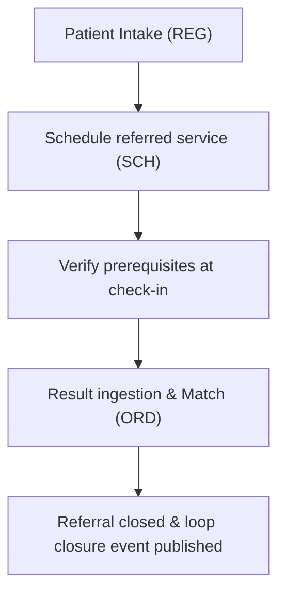

# HMS Platform SaaS — Developer & Architecture Guide

A multi-tenant **Hospital Management System delivered as SaaS** for **Andhra Pradesh, India**.
Product domain: `hms.zensynq.com`.

---

## 1. Technical Architecture & Stack

*   **Language/API:** Python 3.12+ (configured with Python 3.14 compatible typings), FastAPI, Pydantic v2, Uvicorn/Gunicorn.
*   **Database:** PostgreSQL 16+ with Row-Level Security (RLS) for tenant isolation.
*   **ORM / Migrations:** SQLAlchemy 2.0 (async) + Alembic.
*   **Authentication & Authorization:** Keycloak / OIDC + Role-Based Access Controls (RBAC).
*   **FHIR Standard:** `fhir.resources` (Pydantic FHIR R4 models).

---

## 2. Core Non-Negotiable Security Policies

### 2.1 Tenant Isolation (PLT-002)
*   Every tenant-scoped table contains a `tenant_id` column matching the `tenant` table.
*   Connections connect as the non-superuser role `hms_app` which guarantees PostgreSQL Row-Level Security (RLS) policies apply:
    ```sql
    ALTER TABLE patient ENABLE ROW LEVEL SECURITY;
    CREATE POLICY patient_tenant_isolation ON patient 
        USING (tenant_id = current_tenant()) 
        WITH CHECK (tenant_id = current_tenant());
    ```
*   **Never read `tenant_id` from a header, query param, or request body.** It is resolved only from the verified OIDC jwt claims context (`RequestContext`).
*   All queries go through `hms_tenancy.tenant_session(session, ctx)` which automatically binds `app.tenant_id` inside a transaction.

### 2.2 Patient-Data Auditing (PLT-005)
*   Every create, read, update, or export of patient-identifiable clinical/financial records calls `hms_audit.record(...)` inside the **same transaction**.
*   Audit trail events are appended to the immutable, append-only `audit_event` table.

### 2.3 India & Andhra Pradesh Compliance
*   **Aadhaar Data Protection:** Full Aadhaar numbers must never be saved; only the whitelisted `aadhaar_last_four` (last 4 digits) is captured on coverage records.
*   **Cashless Schemes:** Aarogyasri / PMJAY check-ins validate the presence of `aadhaar_last_four` at intake.
*   **NMC Fee-Splitting Ban:** In compliance with NMC rules, referral commission splits are default-disabled for clinic/clinician referrer types.

---

## 3. Core Cross-Cutting Workflows

### 3.1 Closed-Loop Referral Flow (REF)


### 3.2 Prescription-driven Follow-ups (RX)
*   Upon EMR sign-off or prescription completion, clinicians can bind follow-up appointments with pre-visit prerequisites checklists (e.g. fasting, lab tests).
*   Follow-up bookings are created in a `DRAFT` status (**Flag F1**) to allow scheduling staff to coordinate slots.

---

## 4. Module Directory & Endpoints Reference

### Directory Structure
```text
hms/
├── docs/                      # Architectural documents, FRDs, guides
├── libs/                      # Platform core shared libraries
│   ├── hms_auth/              # JWT OIDC parsing and verification
│   ├── hms_tenancy/           # Context sessions and RLS managers
│   └── hms_audit/             # Clinical events logging
├── services/
│   └── plt/                   # Main FastAPI app
│       ├── alembic/           # Schema migration versions (0001 to 0009)
│       └── app/
│           ├── main.py        # Service entrypoint
│           └── routers/       # Router modules
└── tests/                     # Automated integration test suite
```

### Endpoints Cheat Sheet

| Module | Purpose | Endpoint | Gated Roles |
| :--- | :--- | :--- | :--- |
| **IAM** | Authentication | `GET /auth/verify` | Public |
| **REG** | Patients Intake | `POST /patients/register` | `receptionist`, `admin` |
| **SCH** | Scheduling | `POST /appointments/book` | `receptionist`, `admin` |
| **EMR** | Clinical Charts | `POST /encounters/{id}/sign-off` | `physician` |
| **RX** | Prescriptions | `POST /rx/prescribe` | `physician` |
| **ORD** | Lab Results | `POST /ord/results/ingest` | `operator`, `admin` |
| **BIL** | Invoicing / Cash | `POST /bil/invoices/finalize` | `billing_clerk`, `finance_manager` |
| **POR** | Patient Portal | `POST /por/activate` | Public |
| **RPT** | Dashboards | `GET /rpt/dashboards/operational` | `finance_manager`, `billing` |
| **INT** | Integrations | `POST /int/hl7/inbound` | `operator`, `admin` |

---

## 5. Developer Commands & Execution

### Running the Project locally
Deploy the local PostgreSQL db container and Python API service:
```powershell
docker compose up --build
```
Seed mock patients under RLS contexts:
```powershell
docker compose exec plt python -m app.seed
```

### Executing Tests
All 59 unit and integration test suites run locally using pytest:
```powershell
.venv\Scripts\pytest -v tests/
```

---

## 6. Exceptions & HTTP Status Codes

The API returns consistent HTTP status codes mapping to standard system states and failure conditions:

### Standard HTTP Status Codes

*   **`200 OK`**: Standard successful request response (e.g. fetching records, running diagnostic queries).
*   **`201 Created`**: Resource created successfully (e.g. registering patient, scheduling appointment, logging payment).
*   **`400 Bad Request`**: Validation errors, expired activation OTPs, missing clinical encounter data, or signed drug-allergy interactions without override reasons.
*   **`401 Unauthorized`**: Missing, invalid, or expired OIDC JWT bearer tokens.
*   **`403 Forbidden`**: Role-based access denials (e.g. receptionist attempting to sign off EMR chart) or tenant isolation context mismatches.
*   **`404 Not Found`**: Target resource (patient ID, lab order, invoice ID, or subscription ID) does not exist in the database.
*   **`409 Conflict`**: Scheduling time conflicts (practitioner double-bookings) or deterministic duplicate patient registrations.

### Global Exception Handlers

In [main.py](file:///c:/Users/Sivakumar/Documents/files/hms/services/plt/app/main.py), custom exceptions are mapped to clean HTTP responses:
*   **`PermissionError`** -> Returns `403 Forbidden` with detail payload.
*   **`ValueError`** -> Returns `400 Bad Request` with detail payload.

---

## 7. API Input Validations

All inbound payloads are rigorously validated at the entrypoint using Pydantic v2 schemas:

### 7.1 Field-Level Constraints
We enforce boundary checks directly in model fields (e.g. `min_length`, `gt` constraints):
*   `given_name` / `family_name`: String minimum length `1`.
*   `invoice_item` prices: Non-negative floating points.
*   `payment_method_id` & URLs: Required non-empty string fields.

### 7.2 Custom Field Validators
Specific regional constraints are enforced using Pydantic's `@field_validator` decorator:
*   **ABHA Numbers Validation:** Cleans formatting and verifies the input is exactly `14` digits.
*   **Aadhaar Numbers Protection:** Verifies the last 4 digits field is exactly `4` digits (and checks that no full Aadhaar numbers are submitted).

### 7.3 Multi-Field Cross Validators
Logical combinations of attributes are validated using `@model_validator(mode="after")` to verify dependencies:
*   **Referral Attributes:** Asserts that if a referrer type is set, the corresponding name must be set, and vice versa.
*   **Drug-Allergy Interaction Block overrides:** Enforces that if a drug-allergy warnings overlap occurs, the physician must supply a matching clinical override reason.


